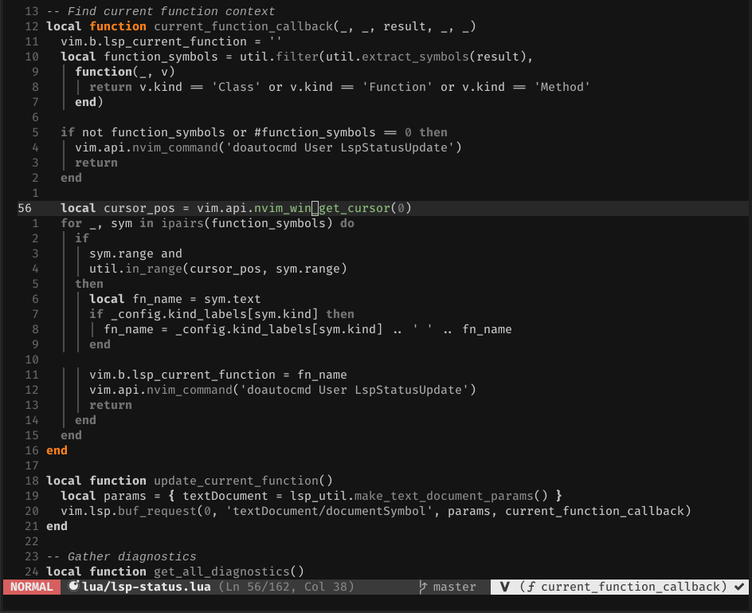
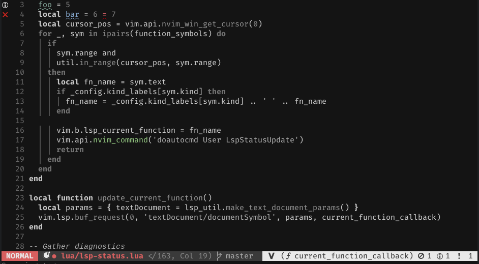
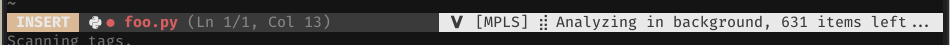

# lsp-status.nvim

This is a Neovim plugin/library for generating statusline components from the built-in LSP client.

## Notices
- **2020/05/25**: There has been a minor breaking change to the API: `extension_callbacks` is now
  named `extensions`. There have also been a number of additions and improvements; see the below
  (specifically [Configuration](#configuration) and [Example Use](#example-use)) for details.

## Contents
1. [Examples](#examples)
2. [Installation](#installation)
3. [Usage](#usage)
    1. [Protocol Extensions](#protocol-extensions)
    2. [Configuration](#configuration)
4. [Example Use](#example-use)
    1. [All together, now](#all-together-now)
5. [Status](#status)
6. [Contributing](#contributing)


## Examples

Show the current containing function (like `b:coc_current_function`):


Easily access diagnostic counts:


Show progress messages from servers:


## Installation

You will need a version of Neovim that includes the built-in LSP client (right now, that means
nightly). Use your preferred package/plugin manager. With
[`vim-packager`](https://github.com/kristijanhusak/vim-packager), this looks like:
```vim
call packager#add('nvim-lua/lsp-status.nvim')
```

## Usage

The plugin provides several utilities:
```lua
update_current_function() -- Set/reset the b:lsp_current_function variable
diagnostics() -- Return a table with all diagnostic counts for the current buffer
messages() -- Return a table listing progress and other status messages for display
register_progress() -- Register the provided callback for progress messages
register_client() -- Register a client for messages
-- Integrate misc. LS protocol extensions into the messages framework
-- Each extension table contains a set of callbacks and a setup() function 
-- returning said callbacks
extensions = { clangd, pyls_ms }
-- Set up a client for use with lsp-status. Calls register_client() and sets up 
-- buffer autocommands
on_attach(client) 
config(config_vals) -- Configure lsp-status
-- Table of client capabilities extended to signal support for progress messages
capabilities 
status() -- One example out-of-the-box statusline component (as shown in the images above)
```
### Protocol Extensions

`lsp-status.nvim` supports messaging-related protocol extensions offered by
[`clangd`](https://clangd.llvm.org/extensions.html#file-status) and [Microsoft's Python language
server](https://github.com/Microsoft/python-language-server) (`python/setStatusBarMessage`,
`python/beginProgress`, `python/reportProgress`, and `python/endProgress`). To use these extensions,
register the callbacks provided in the `extensions` table (the keys for the callbacks are
the relevant LSP method name).

**Note:** For `clangd`, you must also set `init_options = { clangdFileStatus = true }`.

**New**: You can also call `lsp_status.extensions.<server name>.setup()` to return the full set of
callbacks, as shown below.

### Configuration

You can configure `lsp-status.nvim` using the `config` function, which takes a table of
configuration values. The following configuration options are supported:

- `kind_labels`: An optional map from LSP symbol kinds to label symbols. Used to decorate the current function
  name. Default: `{}`
- `select_symbol`: An optional callback of the form `function(cursor_pos, document_symbol)` that
  should return `true` if `document_symbol` (a `DocumentSymbol`) should be accepted as the symbol
  currently containing the cursor.

For example, the [sumneko lua server](https://github.com/sumneko/lua-language-server) sends
`valueRange` (which is not specified in the protocol) to give the range for a function's start and
end. To respect `valueRange`, you can use the following configuration:
```lua
lsp_status.config {
  select_symbol = function(cursor_pos, symbol)
    if symbol.valueRange then
      local value_range = {
        ["start"] = {
          character = 0,
          line = vim.fn.byte2line(symbol.valueRange[1])
        },
        ["end"] = {
          character = 0,
          line = vim.fn.byte2line(symbol.valueRange[2])
        }
      }

      return require("lsp-status.util").in_range(cursor_pos, value_range)
    end
  end
}
```

## Example Use

Here is an example configuration (also using [`nvim-lsp`](https://github.com/neovim/nvim-lsp/))
showing how `lsp-status` can be integrated into one's statusline and other LSP configuration.

**In any Lua file you load:**
```lua
local lsp_status = require('lsp-status')
-- completion_customize_lsp_label as used in completion-nvim
-- Optional: customize the kind labels used in identifying the current function.
-- g:completion_customize_lsp_label is a dict mapping from LSP symbol kind 
-- to the string you want to display as a label
-- lsp_status.config { kind_labels = vim.g.completion_customize_lsp_label }

-- Register the progress callback
lsp_status.register_progress()
```

**Before calling `setup` for each relevant LSP client:**
```lua
-- Set default client capabilities plus window/workDoneProgress
config.capabilities = vim.tbl_extend('keep', config.capabilities or {}, lsp_status.capabilities)
```

**In an `on_attach` function for each relevant LSP client:**
```lua
-- Register client for messages and set up buffer autocommands to update 
-- the statusline and the current function.
-- NOTE: on_attach is called with the client object, which is the "client" parameter below
lsp_status.on_attach(client)
```

**Specific client configuration (following `nvim-lsp` conventions):**
```lua
clangd = {
  callbacks = lsp_status.extensions.clangd.setup()
},
pyls_ms = {
  callbacks = lsp_status.extensions.pyls_ms.setup()
},
```

### LSP statusline segment

An example statusline segment is provided in
[lua/lsp-status/statusline](lua/lsp-status/statusline.lua). You are encouraged to read the source
and develop your own statusline segment, but if you'd like something reasonable out-of-the-box, you
can call `lsp_status.status()` somewhere in your statusline definition (make sure you have
`require`'d the `lsp-status` module too!)

### All together, now

Here's a complete example:

```vim
lua << END
local lsp_status = require('lsp-status')
lsp_status.register_progress()

local nvim_lsp = require('nvim_lsp')

-- Some arbitrary servers
nvim_lsp.clangd.setup({
  callbacks = lsp_status.extensions.clangd.setup(),
  init_options = {
    clangdFileStatus = true
  },
  on_attach = lsp_status.on_attach,
  capabilities = lsp_status.capabilities
})

nvim_lsp.pyls_ms.setup({
  callbacks = lsp_status.extensions.pyls_ms.setup(),
  settings = { python = { workspaceSymbols = { enabled = true }}},
  on_attach = lsp_status.on_attach,
  capabilities = lsp_status.capabilities
})

nvim_lsp.ghcide.setup({
  on_attach = lsp_status.on_attach,
  capabilities = lsp_status.capabilities
})
nvim_lsp.rust_analyzer.setup({
  on_attach = lsp_status.on_attach,
  capabilities = lsp_status.capabilities
})
END

" Statusline
function! LspStatus() abort
  if luaeval('#vim.lsp.buf_get_clients() > 0')
    return luaeval("require('lsp-status').status()")
  endif

  return ''
endfunction

```

## Status

This plugin is "complete" - it works in all the ways it was originally intended to, and it doesn't
seem to break. That said, it hasn't been tested much, and I'm open to adding new features if others
want them.

One thing that probably should be added is proper documentation of some sort. The code could also
stand to be cleaned up.

## Contributing

Bug reports and feature requests are welcome! PRs are doubly welcome!
